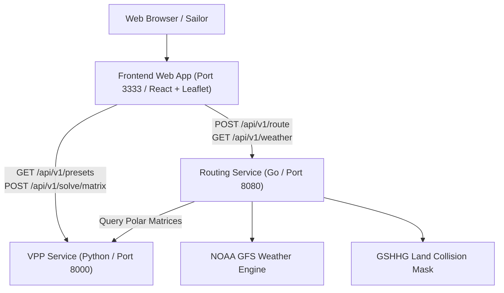

# Sailboat Velocity Prediction Program (VPP) & Weather Routing System

A high-performance, multi-service sailboat weather routing platform combining naval architecture physics, GFS weather forecasting, and isochrone routing algorithms.

---

## Architecture Overview



### The 3 Microservices

1. **VPP Service (`services/vpp/`, Python / FastAPI, Port 8000)**:
   - 3-DOF aero-hydro steady equilibrium solver (Surge, Sway, Roll).
   - Hazen / ORC IMS aerodynamic models for Ketch, Sloop, and Cutter rigs.
   - ITTC-1957 friction & Delft Systematic Yacht Hull Series (DSYHS) wave resistance.
   - Sail trim optimizer (flattening & reefing) and polar table generator.
   - Standard navigation export (ORC `.pol`, CSV) and PNG plotting.

2. **Routing Service (`services/routing/`, Go, Port 8080)**:
   - High-performance Forward **Isochrone Weather Routing Engine** (solves a 650 NM ocean route in **<100ms**).
   - 4D spatial and temporal **NOAA GFS Weather Grid** interpolation (U/V 10m wind).
   - **GSHHG Land Collision Mask** ensuring routes navigate around coastlines and landmasses.
   - Sub-millisecond bilinear polar speed lookup and optimal minimum-time route backtracking.

3. **Frontend Web App (`services/frontend/`, React / TypeScript / Leaflet / Vite / pnpm, Port 3333)**:
   - Interactive nautical map with OpenSeaMap seamarks and GSHHG land boundaries.
   - Live GFS wind vector field overlay (color-coded wind arrows).
   - Yacht selector (36ft Cruising Ketch, 36ft Sloop, 40ft Cruiser, 24ft Sportboat) and passage presets.
   - Isochrone wavefront animation and optimal route path with waypoint inspection.
   - Interactive timeline playback scrubber with real-time speed, heading, wind, and heel metrics.
   - GPX export for chartplotters and route performance profile charts.

---

## Quickstart with Docker Compose

### 1. Production Deployment (Automatic Let's Encrypt SSL)

Configure your domain in `.env`:
```bash
cp .env.example .env
# Edit DOMAIN (e.g. routing.yourdomain.com) and ACME_EMAIL
```

Start the stack:
```bash
docker compose up -d --build
```

- **Caddy Reverse Proxy**: Handles edge TLS/SSL via Let's Encrypt on ports `80` & `443` (with HTTP/3 QUIC).
- **Certificates**: Automatically provisioned, renewed, and persisted in the `sailboat_caddy_data` volume.
- **Microservices**: Secured internally within Docker bridge network `routing-network`.

### 2. Local Testing with Docker Compose

For local testing, simply run:
```bash
docker compose up --build
```
Access the application at [http://localhost](http://localhost) or [https://localhost](https://localhost).

To expose individual microservice ports directly for local development (`:8000`, `:8080`, `:3333`):
```bash
docker compose -f docker-compose.yml -f docker-compose.dev.yml up --build
```

---

## Local Development Setup

### 1. Python VPP Service
```bash
python3 -m venv .venv
source .venv/bin/activate
cd services/vpp
pip install -e .
pytest -v
uvicorn vpp.api.app:app --host 127.0.0.1 --port 8000 --reload
```

### 2. Go Routing Service
```bash
cd services/routing
go test -v ./...
PORT=8080 VPP_SERVICE_URL=http://localhost:8000 go run main.go
```

### 3. Frontend Web Application
```bash
cd services/frontend
pnpm install
pnpm build
pnpm dev
```

---

## API Summary

### Routing Service (`http://localhost:8080`)
| Method | Route | Description |
| :--- | :--- | :--- |
| `GET` | `/health` | Service health status |
| `POST` | `/api/v1/route` | Compute optimal isochrone weather route |
| `POST` / `GET` | `/api/v1/weather/grid` | Query wind vector field for a given area & timestamp |

### VPP Service (`http://localhost:8000`)
| Method | Route | Description |
| :--- | :--- | :--- |
| `GET` | `/health` | Service health check |
| `GET` | `/api/v1/presets` | List yacht presets (including 36ft Ketch) |
| `POST` | `/api/v1/solve/point` | Solve 3-DOF equilibrium for single (TWS, TWA) |
| `POST` | `/api/v1/solve/matrix` | Generate polar speed table and VMG targets |
| `POST` | `/api/v1/export/orc` | Download standard ORC `.pol` polar file |
| `POST` | `/api/v1/plot/polar` | Stream polar diagram as PNG image |
