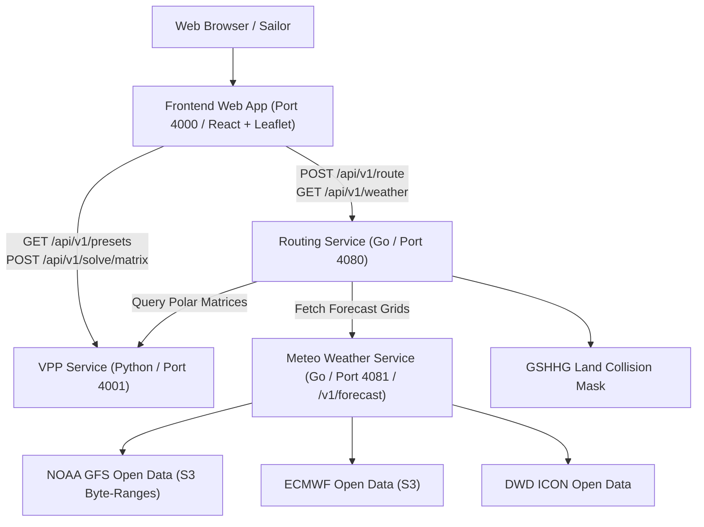

# Sailboat Velocity Prediction Program (VPP) & Weather Routing System

A high-performance, multi-service sailboat weather routing platform combining naval architecture physics, GFS weather forecasting, and isochrone routing algorithms.

---

## Architecture Overview



### The 4 Microservices

1. **Meteo Weather Service (`services/meteo/`, Go, Port 4081 / `/v1/forecast`)**:
   - High-performance, self-hosted **Open-Meteo compatible API** (`/v1/forecast`, `/v1/gfs`, `/v1/ecmwf`, `/v1/grid`).
   - Background NWP ingestion worker for **NOAA GFS 0.25°**, **ECMWF IFS/AIFS 0.25°**, and **DWD ICON 0.25°**.
   - Pure-Go GRIB2 decoder and S3 `.idx` byte-range index scanner (downloads only ~1.5 MB per step instead of full 500 MB files).
   - Optimized multidimensional **Chunked Zarr V2/V3 storage** with Zstandard (`zstd`) compression.
   - Sub-millisecond point time-series queries with 4D bilinear interpolation and spherical antimeridian wrapping.

2. **VPP Service (`services/vpp/`, Python / FastAPI, Port 4001)**:
   - 3-DOF aero-hydro steady equilibrium solver (Surge, Sway, Roll).
   - Hazen / ORC IMS aerodynamic models for Ketch, Sloop, and Cutter rigs.
   - ITTC-1957 friction & Delft Systematic Yacht Hull Series (DSYHS) wave resistance.
   - Sail trim optimizer (flattening & reefing) and polar table generator.
   - Standard navigation export (ORC `.pol`, CSV) and PNG plotting.

3. **Routing Service (`services/routing/`, Go, Port 4080)**:
   - High-performance Forward **Isochrone Weather Routing Engine** (solves a 650 NM ocean route in **<100ms**).
   - 4D spatial and temporal weather interpolation via local Open-Meteo service.
   - **GSHHG Land Collision Mask** ensuring routes navigate around coastlines and landmasses.
   - Sub-millisecond bilinear polar speed lookup and optimal minimum-time route backtracking.

4. **Frontend Web App (`services/frontend/`, React / TypeScript / Leaflet / Vite / pnpm, Port 4000)**:
   - Interactive nautical map with OpenSeaMap seamarks and GSHHG land boundaries.
   - Live GFS wind vector field overlay (color-coded wind arrows).
   - Yacht selector (36ft Cruising Ketch, 36ft Sloop, 40ft Cruiser, 24ft Sportboat) and passage presets.
   - Isochrone wavefront animation and optimal route path with waypoint inspection.
   - Interactive timeline playback scrubber with real-time speed, heading, wind, and heel metrics.
   - GPX export for chartplotters and route performance profile charts.

---

## Quickstart with Docker Compose

### 1. Production Deployment (Automatic Let's Encrypt SSL)

Configure your domain in `.env`:
```bash
cp .env.example .env
# Edit DOMAIN (e.g. routing.yourdomain.com) and ACME_EMAIL
```

Start the stack:
```bash
docker compose up -d --build
```

- **Caddy Reverse Proxy**: Handles edge TLS/SSL via Let's Encrypt on ports `80` & `443` (with HTTP/3 QUIC).
- **Certificates**: Automatically provisioned, renewed, and persisted in the `sailboat_caddy_data` volume.
- **Microservices**: Secured internally within Docker bridge network `routing-network`.

### 2. Local Testing with Docker Compose (Production Build)

For testing the production build with Caddy reverse proxy:
```bash
docker compose up --build
```
Access the application at [http://localhost](http://localhost) or [https://localhost](https://localhost).

---

## Fast Developer Workflows (Vite Hot-Reloading)

### Option 1: Backend in Docker + Vite on Host (Recommended ⚡)

Keep the backend microservices (Go routing engine, Go meteo engine & Python VPP) running in Docker while running the frontend locally with Vite for instantaneous Hot Module Replacement (HMR):

1. Start backend services in Docker (ports `4080`, `4081` & `4001`):
```bash
pnpm dev:backend
# or: docker compose -f docker-compose.yml -f docker-compose.dev.yml up routing-service vpp-service meteo-service
```

2. Start the Vite frontend dev server:
```bash
pnpm dev
```
Open [http://localhost:4000](http://localhost:4000). Code changes to `services/frontend/src/` will reload instantly in your browser without restarting containers.

---

### Option 2: Full Docker Stack with Live Reload

If you prefer running everything in Docker with live file sync:
```bash
pnpm dev:docker
# or: docker compose -f docker-compose.yml -f docker-compose.dev.yml up
```
Open [http://localhost:4000](http://localhost:4000). Local frontend edits will hot-reload inside the container via volume mount.

---

### Option 3: Pure Local Development (No Docker)

#### 1. Python VPP Service
```bash
python3 -m venv .venv
source .venv/bin/activate
cd services/vpp
pip install -e .
pytest -v
uvicorn vpp.api.app:app --host 127.0.0.1 --port 4001 --reload
```

#### 2. Go Meteo Weather Service
```bash
cd services/meteo
go test -v ./...
PORT=4081 go run ./cmd/api
```

#### 3. Go Routing Service
```bash
cd services/routing
go test -v ./...
PORT=4080 VPP_SERVICE_URL=http://localhost:4001 METEO_SERVICE_URL=http://localhost:4081 go run main.go
```

#### 4. Frontend Web Application
```bash
pnpm dev
```

---

### Meteo Weather Service (`http://localhost:4081`)
| Method | Route | Description |
| :--- | :--- | :--- |
| `GET` | `/health` | Service health status |
| `GET` | `/v1/forecast` | Standard Open-Meteo point/multi-point forecast query (`latitude`, `longitude`, `hourly`, `models`, `wind_speed_unit`) |
| `GET` | `/v1/gfs` | Open-Meteo GFS alias endpoint |
| `GET` | `/v1/ecmwf` | Open-Meteo ECMWF alias endpoint |
| `GET` | `/v1/dwd-icon` | Open-Meteo DWD ICON alias endpoint |
| `GET` / `POST` | `/v1/grid` | High-throughput 2D bounding-box / corridor wind & pressure field query |

### Routing Service (`http://localhost:4080`)
| Method | Route | Description |
| :--- | :--- | :--- |
| `GET` | `/health` | Service health status |
| `POST` | `/api/v1/route` | Compute optimal isochrone weather route |
| `POST` / `GET` | `/api/v1/weather/grid` | Query wind vector field for a given area & timestamp |

### VPP Service (`http://localhost:4001`)
| Method | Route | Description |
| :--- | :--- | :--- |
| `GET` | `/health` | Service health check |
| `GET` | `/api/v1/presets` | List yacht presets (including 36ft Ketch) |
| `POST` | `/api/v1/solve/point` | Solve 3-DOF equilibrium for single (TWS, TWA) |
| `POST` | `/api/v1/solve/matrix` | Generate polar speed table and VMG targets |
| `POST` | `/api/v1/export/orc` | Download standard ORC `.pol` polar file |
| `POST` | `/api/v1/plot/polar` | Stream polar diagram as PNG image |
